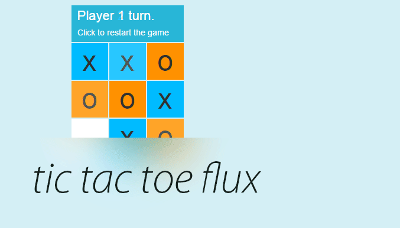
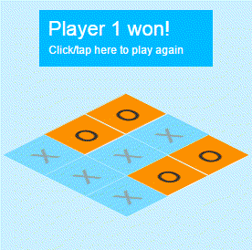

<p align="center">
  
</p>

**[Live example](https://rawgit.com/hackhat/tic-tac-toe-flux/v0.0.4/dist/index.html)**


This is just a simple tic tac toe game using the flux architecture and react view engine.

<p align="center">
  
</p>

Test is located at [BoardStore-test.js](./src/js/stores/__tests__/BoardStore-test.js).

Special features:

 - When the game ends highlights the tiles that resulted in a win;
 - Even in the edge case that is shown in the gif above where 5 tiles are the winners;
 - Works on mobile and is not lagging because uses on mouse down instead of click (this removes the 300ms lag on mobile);

## Running your project

The generated project includes a live-reloading static server on port `8080` (you can change the port in the `gulpfile.js` config), which will build, launch, and rebuild the app whenever you change application code. To start the server, run:

```bash
$ npm start
```

If you want to run on a certain host run with `npm run dev --host=192.168.1.70`;

If you prefer to just build without the live reload and build-on-each-change watcher, run:

```bash
$ npm run build
```

To test run:

```bash
$ npm run test
```